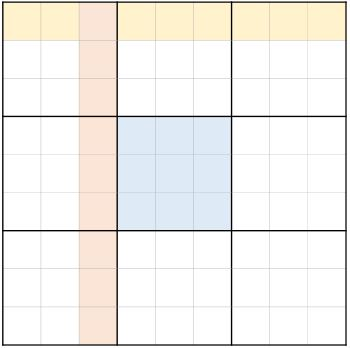
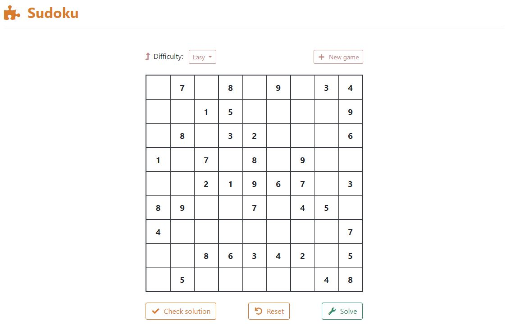
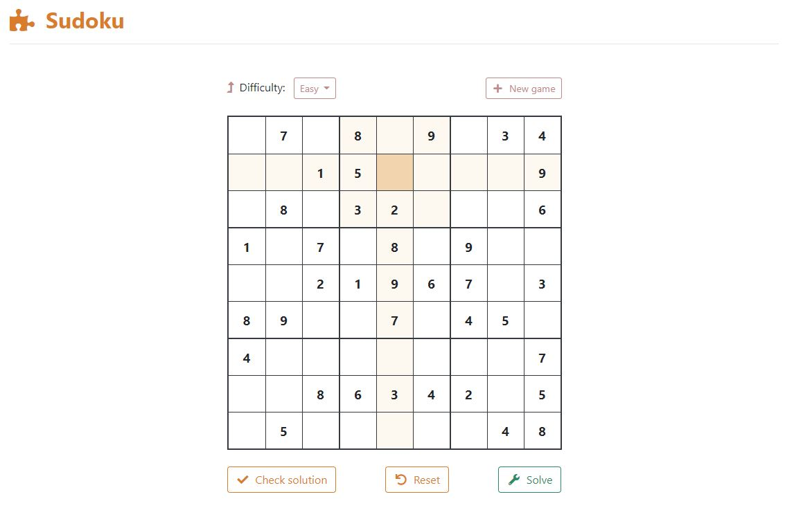

# Sudoku

https://playsudoku.herokuapp.com/

# Overview

This repository contains a Python implementation of 9x9 Sudoku.
The relevant game files are located in the `models` and `puzzles` directories.

`models/constants.py` contains the constants used for the Sudoku code.
`models/sudoku.py` contains the main logic used to model Sudoku.
It also includes the solver code and a verification algorithm.
`puzzles/generate.py` contains a script that generates random puzzles.
The puzzles are generated ahead of time and loaded into memory when the application runs.

The server-side application is written using Flask. It serves a single HTML page
in addition to a few API endpoints for the web interface.
The client-side code is written using jQuery.

# Rules

Sudoku is played on a 9x9 board. Each cell can contain a value between 1-9.
The objective is to fill out the board in accordance with the following rules:

1. Each row must not contain duplicate values
2. Each column must not contain duplicate values
3. Each 3x3 grid must not contain duplicate values

An example of each unit is highlighted below. Valid 3x3 grids are surrounded by borders.

# Interface

The game can be accessed at https://playsudoku.herokuapp.com/.
It works on computer devices that use keyboard inputs (e.g. desktop, laptop), but will not function properly on mobile phones.

Play by selecting missing cells and typing in values between 1-9. Invalid values will not register.
Move to different cells by clicking or using the arrow keys.
To remove an input, press the `backspace` key or the `delete` key while a cell is selected.
The selected cell is always highlighted in orange, and its corresponding row, column, and 3x3 grid are highlighted in light-orange.

Button functionality:
* Difficulty - the difficulty of the next puzzle that will be generated when a new game starts
* New game - loads a new puzzle of the specified difficulty
* Check solution - checks whether the current state of the board represents a solution to the puzzle
* Reset - resets the puzzle
* Solve - fills in the missing cells with the solution to the puzzle
